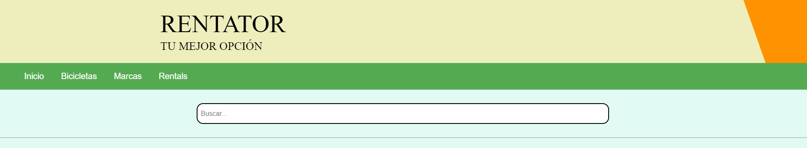
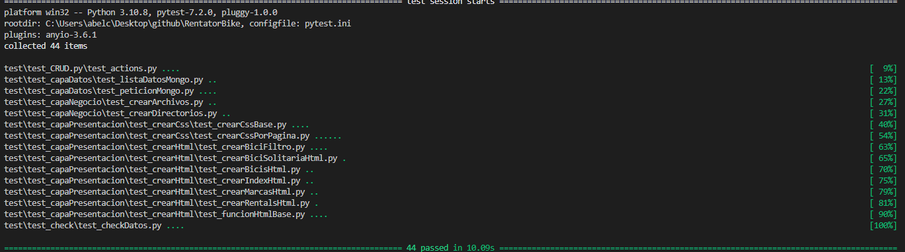
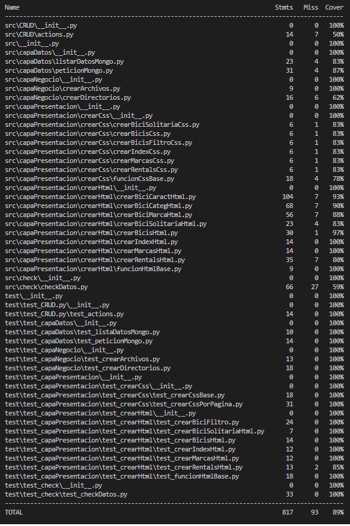
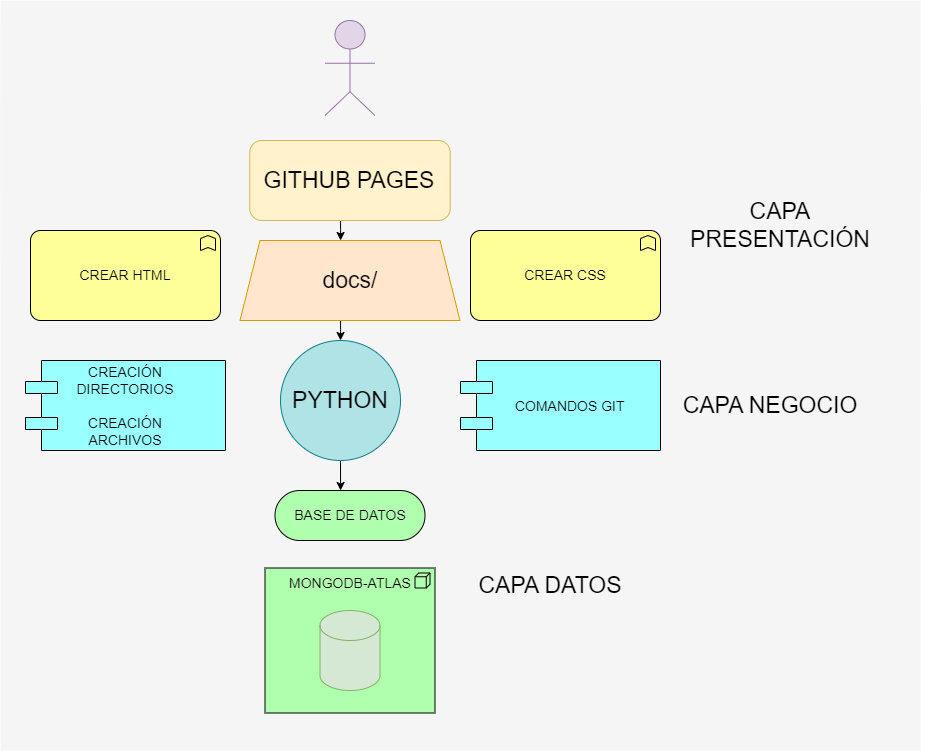
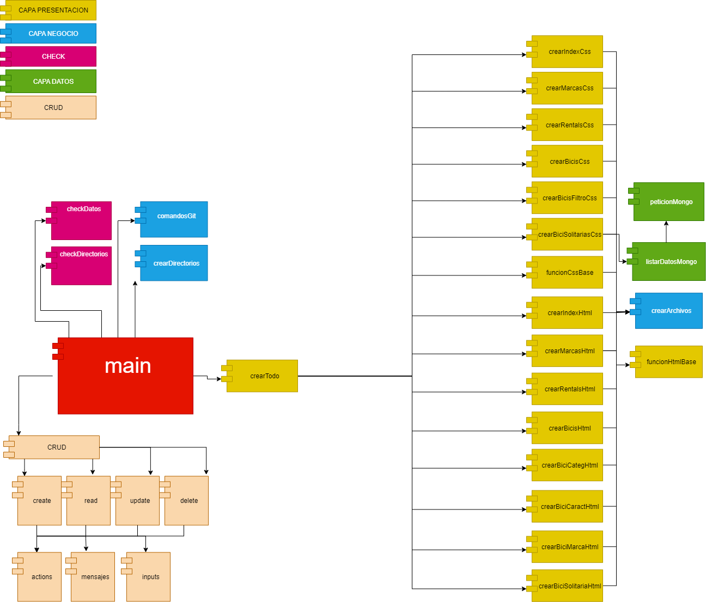
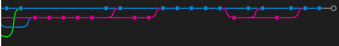
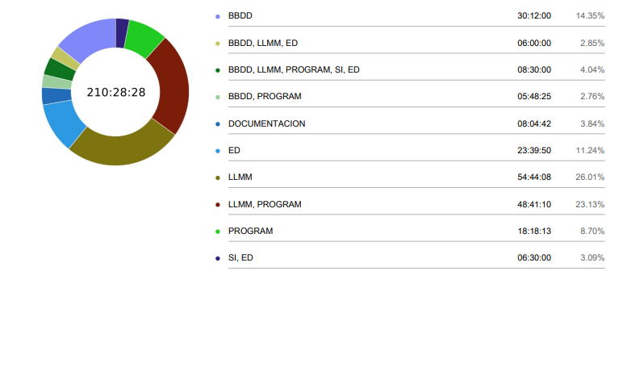

# RentatorBike

## Contenido del Proyecto R.B

* [**Introducción**](#introducción)
* [**Requisitos**](#requisitos)
* [**Funcionamiento**](#funcionamiento)
* [**Tecnologías**](#tecnologías)
* [**Arquitectura**](#arquitectura)
* [**Diagrama de componentes**](#diagrama-de-componentes)
* [**Base de datos**](#base-de-datos)
* [**Git**](#git)
* [**Metodología de trabajo**](#metodología-de-trabajo)
* [**Conclusión**](#conclusión)

## INTRODUCCIÓN

---

Este proyecto nace con la idea de conseguir una movilidad sostenible, está enfocado al alquiler de bicicletas además añadiendo así, valor a la red cicloturística.

Facilitando una completa y sencilla adapatacion al mundo del ciclismo, hemos creado un generador de paginas estáticas que nos permite garantizar al usuario una interfaz amigable en la cual pueda encontrar la bici adaptada a sus necesidades.

## REQUISITOS

---

* Python
* Git
* Pytest
* Request
* Api-key
* Atlas cluster de MongoDB
* Recomendación: creación de un entorno virtual local

## FUNCIONAMIENTO

---

El funcionamiento de la aplicación consta de varias partes.

En primer lugar, contamos con un módulo que nos permitirá ejecutar un CRUD sobre la base de datos de MongoDB.

Un CRUD consiste en poder ejercer 4 operaciones básicas en la base de datos:

* Crear documentos
* Leer los documentos existentes
* Actualizar la información de la base de datos
* Eliminar documentos

Además, contamos con un generador de páginas web estáticas, que grácias a una aplicación de python, conseguimos crear documentos HTML y CSS que van a ser desplegados por GitHub Pages que se encargará de servirnos dichos archivos como páginas web.

Por último contamos con una amplia variedad de casos test con los cuales podremos comprobar que nuestra aplicación continúa funcionando correctamente.

Grácias a pytest y coverage, hemos sido capaces de ir comprobando que nuestra aplicación funcionaba correctamente y de la manera en la que se esperaba.

Para comprobar el funcionamiento de dicha aplicación simplemente sería necesario ejecutar el archivo main.py en el directorio del programa y seguir las instrucciones del mismo.

## TECNOLOGÍAS

---

En nuestro proyecto implementamos las siguientes tecnologias:

* HTML / CSS
* PYTHON
* MONGODB / DATA API
* GIT
* GITHUB PAGES
* MARKDOWN

Con los cuales hemos sido capaces de unir todas las piezas para que un usuario final consiga una página web con la cual buscar una bicicleta adaptadan a sus necesidades.

## ARQUITECTURA

---

La arquitectura de nuestro pequeño software es la siguiente:

En la foto vemos que contamos con 3 capas:

* Capa datos: estaría relacionada con MongoDB y la base de datos. Grácias a esta capa, tenemos una amplia gama de bicis que ofrecer.
* Capa negocio: grácias a esta capa, somos capaces de ejecutar correctamente nuestra aplicación con la creación de los directorios y una implementación automática de git para que nuestra página se actualice cada vez que se ejecuta el programa.
* Capa presentación: en esta capa encontramos todos los programas necesários para generar los archivos html y css que posteriormente seran representados por GitHub Pages para los usuarios. Recomendamos visitar nuestra página desplegada por dicho servicio (link de pagina web).

## DIAGRAMA DE COMPONENTES

---

Además de un pequeño vistazo a la arquitectura de nuestro programa, vamos a hacer una pequeña explicación de todos los componentes que forman nuestra aplicación:

Como ya comentamos antes, nuestro proyecto está divido en capas. En el diagrama de componentes podemos ver que todo se ejecuta desde un programa "main.py".

En primer lugar, encontramos las funcionalidades CRUD, que mediante una sencilla interfaz gráfica podremos interactuar con nuestro cluster de Mongo.

Desde la "capa de datos", conseguimos la respuesta de MongoDB, la transformamos a la estructura de datos con la cual queremos interactuar y la servimos para que en la capa de presentación se generen correctamente los archivos HTML.

Grácias a la "capa de negocio", podemos ubicar correctamente los archivos y directorios que posteriormente serán actualizados en la pagina web Github mediante comandos automatizados de Git.

Posteriormente, cuando conseguimos los datos y tenemos creados los directorios, nuestro paquete de "capa de presentación" se encargará de mediante los datos conseguidos de MongoDB generar los archivos HTML y CSS para que sean desplegados por GitHub Pages.

Finalmente, con nuestro paquete "check" confirmaremos que los datos y directorios son creados y manipulados correctamente para que el programa consiga ejecutar correctamente la aplicación.

## BASE DE DATOS

---

Contamos con un cluster de MongoDB Atlas, que utilizando su servicio gratuito en la nube, hemos sido capaces de almacenar la información de las bicicletas y rentals que vamos a servir en nuestro generador de sitios web estáticos.

Nuestra base de datos tiene un esquema un poco complejo asi que os dejaremos un ejemplo de un documento con el cual nuestro programa interactua.

    {_idbike: 'PA0101',
    state: 'up',
    type: 'bici de ciudad',
    techinfo: { groupset: 'kask', size: 'x', wheels: '29', brand: 'cube' },
    complements: [
        'casco',
        'luz',
        'bomba',
        'guardabarros',
        'candado',
        'potenciometro'],
    prize_euros_days: '15',
    where:{ _idrental: 'PA01' },
    img:'http://imgfz.com/i/CiZJnhA.jpeg'
    }

## GIT

---

Hemos implementado Git para asi poder trabajar con nuestro compañero en remoto y para poder tener un seguimiento del progreso de nuestro proyecto.

Para poder colaborar correctamente con nuestro compañero, hemos decidido trabajar con varias ramas, para evitar malos entendidos y problemas a la hora de desarrollar funcionalidades en nuestra aplicación.

Hemos utilizado 3 ramas base para nuestra correcta elaboración del producto:

* La rama main, con la cual intentabamos mantener nuestro código seguro de posibles bugs
* La rama develop, con la cual implementábamos todas las funcionalidades en la rama main
* La rama página, con la cual desplegábamos la generación de web estáticas.

Y finalmente, utilizábamos una rama "feature" con la cual implementábamos en la rama develop todas las nuevas funcionalidades y, correcciones de bugs.

## METODOLOGÍA DE TRABAJO

---

En el desarrollo del programa se han implementado las siguientes metodologias.

* Metodologia SCRUM: creación de un proyecto en github. Creación de un "backlog" en github projects.
* Sesiones de Pair Programming: sesiones de programación en pareja para garantizar un correcto funcionamiento del equipo.
* Trabajo Remoto: grácias a git hemos podido trabajar en remoto y poder comunicar nuestro trabajo.
* Division del Trabajo: división del trabajo por ramas/tareas con las cuales cada uno podía codificar una nueva funcionalidad sin problema.
* TDD: hemos intentado desarrollar la aplicación mediante la técnica de desarrollo "test driven development".
* SRP y OCP: mientras creábamos la estructura del programa hemos tenido en cuenta los dos primero principios SOLID.

## CLOCKIFY

---

En el desarrollo del programa hemos utilizado Clockify para llevar un seguimiento de las horas de trabajo independiente de cada miembro del equipo. Consiguiendo así una pequeña valoración de nuestro tiempo invertido en el proyecto.

Tras un pequeño análisis a posteriori, llegamos a la conclusión de que hemos invertido mucho más tiempo del esperado en funcionalidades para generar el código html, así como el diseño de las páginas y su estructura html/css.

Hemos "malgastado" mucho tiempo en corregir errores, en implementar correctamente el funcionamiento de git ya que hemos tenido muchos problemas en un inicio para poder y en afianzar conceptos con los cuales poder desarrollar correctamente la aplicación.

A pesar de todos los obstáculos mientras desarrollábamos esta aplicación, consideramos que hemos cumplido con nuestros objetivos iniciales. Inviertiendo timepo y esfuerzo, hemos conseguido desarrolar un generador de sitios web estático, que era el principal objetivo de este proyecto.

## CONCLUSIÓN

---

### **Mejoras**

Como principal defecto a nuestro proyecto, consideramos que está demasiado arraigado a nuestra base de datos, todo esta muy encasillado a un esquema en concreto y nos habría gustado implementar un generador más general con el cual poder adaptarlo a cualquier base de datos, sin embargo, por la falta de tiempo no hemos podido desarrollarlo de esta manera. Además, nos habría gustado implementar typer, y otras librerías que habrían hecho de nuestra aplicación un poco más agradable.

### **Dificultades**

Como ya nombramos antes, hemos tenido varios problemas para implementar correctamente el funcionamiento de git y gitflow, ya que tuvimos que ir aprendiendo a base de errores.

También, por nuestra falta de conocimientos y experiencia, hemos tenido que ir lidiando con errores constantes y teniendo que corregir nuestro própios errores que nos han hecho ir perdiendo tiempo útil que podríamos haber invertido en otras cosas.
